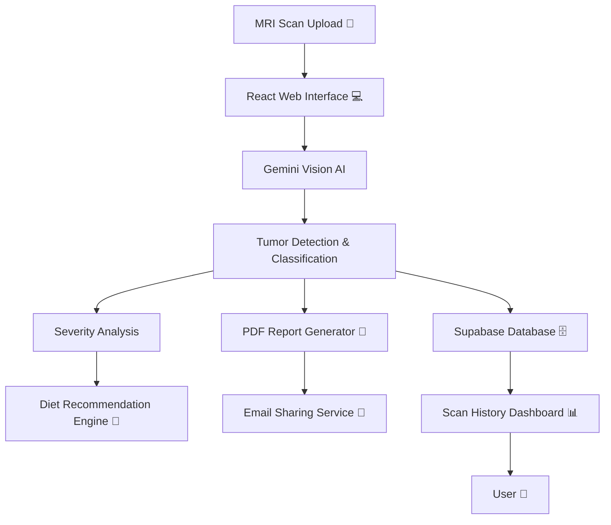

# 🧠 NeuroScan AI – AI-Powered Brain Tumor Detection Platform

<div align="center">


</div>

---

## 🚀 Introduction  

**NeuroScan AI** is an **AI-powered medical web platform** that assists in the **early detection and analysis of brain tumors** using MRI scan images. The platform combines **modern frontend engineering**, **serverless backend infrastructure**, and **advanced multimodal AI models** to deliver fast, accurate, and explainable results.

The system can determine:
- Whether a **brain tumor is present or absent**
- The **type of tumor detected**
- The **severity / level** of the tumor  

In addition, NeuroScan AI generates **personalized dietary recommendations**, produces **downloadable PDF medical reports**, securely **shares reports with family members**, and maintains a **complete scan history** for long-term monitoring.

---

## ✨ Features  

| Feature | Description |
|------|------------|
| 🧠 **Tumor Detection** | AI-based classification to detect presence or absence of brain tumors. |
| 🧬 **Tumor Type Identification** | Identifies tumor type (e.g., Glioma, Meningioma, Pituitary). |
| 📊 **Severity & Level Analysis** | Estimates tumor level for better clinical insight. |
| 🍎 **Diet Recommendations** | AI-generated recommended & avoid-food guidance. |
| 📄 **Downloadable Reports** | Auto-generated PDF reports with visual insights. |
| 👨‍👩‍👦 **Family Report Sharing** | Secure email delivery of reports to family members. |
| 🗂️ **Scan History** | Stores and visualizes historical MRI scans & reports. |
| 🎨 **Theme Switching** | Light/Dark mode using system-aware theming. |
| 🔐 **Secure Data Storage** | Powered by Supabase authentication & Postgres. |
| 🧠 **3D Visualization** | MRI rendering & overlays using WebGL / Three.js. |

---

## 🛠️ Tech Stack  

### 🎨 Frontend  


 


---

### 📝 Forms & Validation  


---

### 📊 Data & Charts  


---

### 🧊 3D Imaging & Reporting  


---

### ☁️ Backend & Database  


---

### 🤖 AI / Machine Learning  


---

## 🔧 NeuroScan AI — System Architecture  



# File Tree: clarity-scan-ai-main

**Root Path:** `c:\Users\dinesh\Downloads\clarity-scan-ai-main`

```
├── 📁 clarity-scan-ai-main
│   ├── 📁 public
│   │   ├── 📁 images
│   │   │   ├── 🖼️ ai-processing.svg
│   │   │   ├── 🖼️ detailed-report.svg
│   │   │   ├── 🖼️ tumor-detection.svg
│   │   │   └── 🖼️ upload-mri.svg
│   │   ├── 📄 favicon.ico
│   │   ├── 🖼️ placeholder.svg
│   │   └── 📄 robots.txt
│   ├── 📁 src
│   │   ├── 📁 components
│   │   │   ├── 📁 ui
│   │   │   │   ├── 📄 accordion.tsx
│   │   │   │   ├── 📄 alert-dialog.tsx
│   │   │   │   ├── 📄 alert.tsx
│   │   │   │   ├── 📄 aspect-ratio.tsx
│   │   │   │   ├── 📄 avatar.tsx
│   │   │   │   ├── 📄 badge.tsx
│   │   │   │   ├── 📄 breadcrumb.tsx
│   │   │   │   ├── 📄 button.tsx
│   │   │   │   ├── 📄 calendar.tsx
│   │   │   │   ├── 📄 card.tsx
│   │   │   │   ├── 📄 carousel.tsx
│   │   │   │   ├── 📄 chart.tsx
│   │   │   │   ├── 📄 checkbox.tsx
│   │   │   │   ├── 📄 collapsible.tsx
│   │   │   │   ├── 📄 command.tsx
│   │   │   │   ├── 📄 context-menu.tsx
│   │   │   │   ├── 📄 dialog.tsx
│   │   │   │   ├── 📄 drawer.tsx
│   │   │   │   ├── 📄 dropdown-menu.tsx
│   │   │   │   ├── 📄 form.tsx
│   │   │   │   ├── 📄 hover-card.tsx
│   │   │   │   ├── 📄 input-otp.tsx
│   │   │   │   ├── 📄 input.tsx
│   │   │   │   ├── 📄 label.tsx
│   │   │   │   ├── 📄 menubar.tsx
│   │   │   │   ├── 📄 navigation-menu.tsx
│   │   │   │   ├── 📄 pagination.tsx
│   │   │   │   ├── 📄 popover.tsx
│   │   │   │   ├── 📄 progress.tsx
│   │   │   │   ├── 📄 radio-group.tsx
│   │   │   │   ├── 📄 resizable.tsx
│   │   │   │   ├── 📄 scroll-area.tsx
│   │   │   │   ├── 📄 select.tsx
│   │   │   │   ├── 📄 separator.tsx
│   │   │   │   ├── 📄 sheet.tsx
│   │   │   │   ├── 📄 sidebar.tsx
│   │   │   │   ├── 📄 skeleton.tsx
│   │   │   │   ├── 📄 slider.tsx
│   │   │   │   ├── 📄 sonner.tsx
│   │   │   │   ├── 📄 switch.tsx
│   │   │   │   ├── 📄 table.tsx
│   │   │   │   ├── 📄 tabs.tsx
│   │   │   │   ├── 📄 textarea.tsx
│   │   │   │   ├── 📄 toast.tsx
│   │   │   │   ├── 📄 toaster.tsx
│   │   │   │   ├── 📄 toggle-group.tsx
│   │   │   │   ├── 📄 toggle.tsx
│   │   │   │   ├── 📄 tooltip.tsx
│   │   │   │   └── 📄 use-toast.ts
│   │   │   ├── 📄 AnalysisResults.tsx
│   │   │   ├── 📄 Brain3D.tsx
│   │   │   ├── 📄 BrainDetector.tsx
│   │   │   ├── 📄 Footer.tsx
│   │   │   ├── 📄 MRIUploader.tsx
│   │   │   ├── 📄 NavLink.tsx
│   │   │   ├── 📄 Navigation.tsx
│   │   │   ├── 📄 ScanHistory.tsx
│   │   │   ├── 📄 SegmentationOverlay.tsx
│   │   │   ├── 📄 Testimonials.tsx
│   │   │   ├── 📄 ThemeToggle.tsx
│   │   │   ├── 📄 Timeline.tsx
│   │   │   └── 📄 UserMenu.tsx
│   │   ├── 📁 hooks
│   │   │   ├── 📄 use-mobile.tsx
│   │   │   ├── 📄 use-toast.ts
│   │   │   └── 📄 useAuth.tsx
│   │   ├── 📁 integrations
│   │   │   └── 📁 supabase
│   │   │       ├── 📄 client.ts
│   │   │       └── 📄 types.ts
│   │   ├── 📁 lib
│   │   │   └── 📄 utils.ts
│   │   ├── 📁 pages
│   │   │   ├── 📄 About.tsx
│   │   │   ├── 📄 Auth.tsx
│   │   │   ├── 📄 Community.tsx
│   │   │   ├── 📄 Contact.tsx
│   │   │   ├── 📄 Dashboard.tsx
│   │   │   ├── 📄 Detector.tsx
│   │   │   ├── 📄 Disclaimer.tsx
│   │   │   ├── 📄 FAQ.tsx
│   │   │   ├── 📄 Home.tsx
│   │   │   ├── 📄 HowItWorks.tsx
│   │   │   ├── 📄 Index.tsx
│   │   │   ├── 📄 NotFound.tsx
│   │   │   ├── 📄 Privacy.tsx
│   │   │   ├── 📄 Profile.tsx
│   │   │   └── 📄 Terms.tsx
│   │   ├── 📁 styles
│   │   ├── 📁 utils
│   │   │   ├── 📄 brainTumorClassifier.ts
│   │   │   └── 📄 pdfReportGenerator.ts
│   │   ├── 🎨 App.css
│   │   ├── 📄 App.tsx
│   │   ├── 🎨 index.css
│   │   ├── 📄 main.tsx
│   │   └── 📄 vite-env.d.ts
│   ├── 📁 supabase
│   │   ├── 📁 functions
│   │   │   ├── 📁 analyze-brain-mri
│   │   │   │   └── 📄 index.ts
│   │   │   └── 📁 segment-brain-tumor
│   │   │       └── 📄 index.ts
│   │   ├── 📁 migrations
│   │   │   ├── 📄 20251212072153_af912736-36e3-4609-9ea7-c8df6d6178bc.sql
│   │   │   ├── 📄 20251213170654_5f89fac9-04bc-42a3-8a49-0d5e47f0906b.sql
│   │   │   ├── 📄 20251215031032_279fbe2a-b56f-49da-a42f-c261e3d98def.sql
│   │   │   └── 📄 20251216053430_692b888e-500c-4e53-9faf-57fad3646fc4.sql
│   │   └── ⚙️ config.toml
│   ├── ⚙️ .gitignore
│   ├── 📝 README.md
│   ├── 📄 bun.lockb
│   ├── ⚙️ components.json
│   ├── 📄 eslint.config.js
│   ├── 🌐 index.html
│   ├── ⚙️ package-lock.json
│   ├── ⚙️ package.json
│   ├── 📄 postcss.config.js
│   ├── 📄 tailwind.config.ts
│   ├── ⚙️ tsconfig.app.json
│   ├── ⚙️ tsconfig.json
│   ├── ⚙️ tsconfig.node.json
│   └── 📄 vite.config.ts
├── 📁 public
│   └── 🌐 index.html
├── ⚙️ .firebaserc
├── ⚙️ .gitignore
├── ⚙️ firebase.json
├── ⚙️ package-lock.json
└── ⚙️ package.json
```

---

## Contributing 🤝

Contributions are welcome! If you’d like to improve this project or add features, feel free to:

1. Fork the repo.
2. Create a new branch.
3. Submit a pull request.

I appreciate all suggestions for enhancement! 🙏

---

## Contact Me 📬

Let’s connect:

[](mailto:m.dinesh.it27@gmail.com)
[](https://www.linkedin.com/in/m-dinesh-d30/)
[](https://www.instagram.com/_dinx_pvt_430)
[](https://m-dinesh-30.web.app/)
[](https://github.com/dineshit27)
