# 🧠 NeuroScan AI – AI-Powered Brain Tumor Detection Platform

---

## 🚀 Introduction  

**NeuroScan AI** is an **AI-powered medical web platform** that assists in the **early detection and analysis of brain tumors** using MRI scan images. The platform combines **modern frontend engineering**, **serverless backend infrastructure**, and **advanced multimodal AI models** to deliver fast, accurate, and explainable results.

The system can determine:
- Whether a **brain tumor is present or absent**
- The **type of tumor detected**
- The **severity / level** of the tumor  

In addition, NeuroScan AI generates **personalized dietary recommendations**, produces **downloadable PDF medical reports**, securely **shares reports with family members**, and maintains a **complete scan history** for long-term monitoring.

---

## ✨ Features  

| Feature | Description |
|------|------------|
| 🧠 **Tumor Detection** | AI-based classification to detect presence or absence of brain tumors. |
| 🧬 **Tumor Type Identification** | Identifies tumor type (e.g., Glioma, Meningioma, Pituitary). |
| 📊 **Severity & Level Analysis** | Estimates tumor level for better clinical insight. |
| 🍎 **Diet Recommendations** | AI-generated recommended & avoid-food guidance. |
| 📄 **Downloadable Reports** | Auto-generated PDF reports with visual insights. |
| 👨‍👩‍👦 **Family Report Sharing** | Secure email delivery of reports to family members. |
| 🗂️ **Scan History** | Stores and visualizes historical MRI scans & reports. |
| 🎨 **Theme Switching** | Light/Dark mode using system-aware theming. |
| 🔐 **Secure Data Storage** | Powered by Supabase authentication & Postgres. |
| 🧠 **3D Visualization** | MRI rendering & overlays using WebGL / Three.js. |

---

## 🛠️ Tech Stack  

### 🎨 Frontend  

 

---

### 📝 Forms & Validation  

---

### 📊 Data & Charts  

---

### 🧊 3D Imaging & Reporting  

---

### ☁️ Backend & Database  

---

### 🤖 AI / Machine Learning  

---

## 🔧 NeuroScan AI — System Architecture  

```mermaid
graph TD
    A[MRI Scan Upload 🧠] --> B[React Web Interface 💻]
    B --> C[Gemini Vision AI]
    C --> D[Tumor Detection & Classification]
    D --> E[Severity Analysis]
    E --> F[Diet Recommendation Engine 🍎]
    D --> G[PDF Report Generator 📄]
    G --> H[Email Sharing Service 📧]
    D --> I[Supabase Database 🗄️]
    I --> J[Scan History Dashboard 📊]
    J --> K[User 👤]
```

## Contributing 🤝

Contributions are welcome! If you’d like to improve this project or add features, feel free to:

1. Fork the repo.
2. Create a new branch.
3. Submit a pull request.

I appreciate all suggestions for enhancement! 🙏

---

## Contact Me 📬

Let’s connect:

